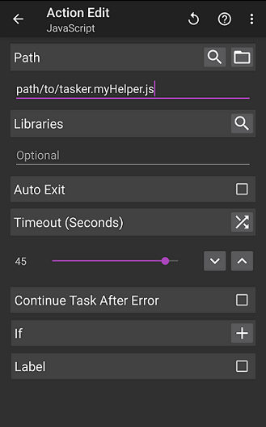

# Tasker JavaScript Helpers

In some instances, it's much easier to accomplish things in [Tasker](https://play.google.com/store/apps/details?id=net.dinglisch.android.taskerm&hl=en), such as data manipulation, by [using JavaScript](http://tasker.dinglisch.net/userguide/en/javascript.html).

Here you'll find a sandbox to make writing and testing JavaScript for Tasker easier, plus my own JavaScript helper functions.

This repository gives you an environment that lets you:
- organize your JavaScript into multiple files for code re-use
- export your JavaScript to a single file, per script/helper, which Tasker expects
- test your script on your computer without cluttering it with initialization of Tasker local variables or placeholder functions; the script on your computer will be exactly the same as what's on your Android device
- know exactly how your script will behave on your Android device
- use npm packages to enhance your JavaScript

## Quick Start

### One-time steps
First you need to install [Node.js](https://nodejs.org/download/).

### From a fresh clone or fetch of the repository

Install dependencies:

    $ npm install

Create Tasker-friendly versions of any helpers in `./src`:

    $ npm run taskerfy

Move the exported helper(s) in `./dist` onto your Android device.

Within a Tasker task, create a JavaScript action, disable "Auto Exit", and point to any of the helpers. That's it!

## Helper functions

### Sparkle Laundry Status

If you live in an apartment building with Sparkle Laundry machines, [their website](https://mysparkle.ca/) gives a lot of information on what machines are in use and who used them last.

#### Requirements

Setup a task in Tasker to login, then request data from https://mysparkle.ca/machines.json.

Before you call this helper, set the following local variables:

- `allmachinesjson` - a JSON string of https://mysparkle.ca/machines.json
- `address` - exact or partial address where the laundry machines are located
- `cardnumber` - your laundry card number
- `availability_wait_time_mins` - estimated time, in minutes, it takes for someone to retrieve their laundry after the cycle is done

#### Output

On completion, sets the following variables:
- `dryer_availability` - how many dryers are available (e.g. 8/11)
- `washer_availability` - how many washers are available
- `done_machines` - a list of washer and dryer machine names you've used that are done
- `in_progress_machines` - a list of washer and dryer machine names you've used that are still in progress (with time estimations on when they'll be complete)
- `washer_time_remaining_min` - of the washers you have recently used, the min time remaining
- `washer_time_remaining_max` - of the washers you have recently used, the max time remaining
- `dryer_time_remaining_min` - of the dryers you have recently used, the min time remaining
- `dryer_time_remaining_max` - of the dryers you have recently used, the max time remaining

### The Walking Dead Next Issue

Retrieves details about the next issue of the Walking Dead comic. It sets the following local task variables:

- `img` - the URL to the issue cover
- `issueno` - the issue number
- `days` - the number of days until the issue
- `date` - the date that the issue with be available.

Do with that information what you will! For example, [you can use AutoNotification](http://imgur.com/a/ZPTwv#0) to notify you when there's a new issue coming out.
