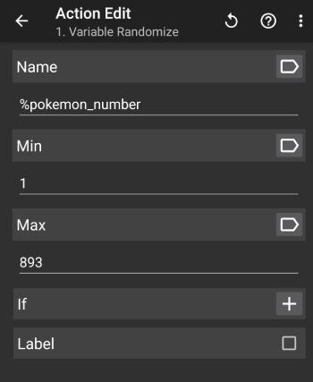
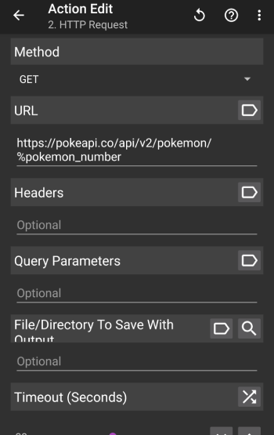
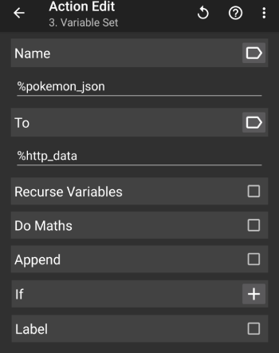
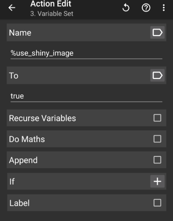
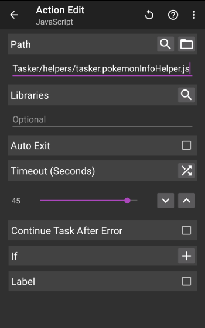
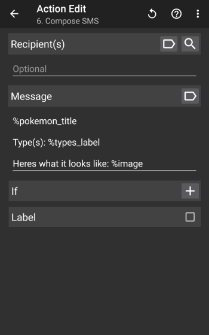
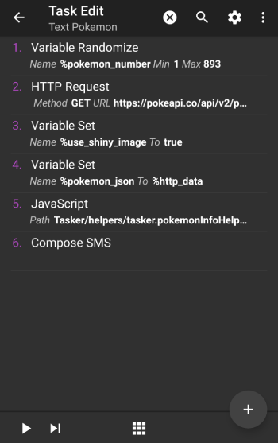
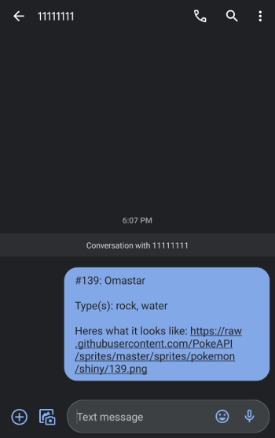

# Tutorial

Let's walk through how to use this to create your own Tasker JavaScript helpers using an example.

Say you want to educate your friend about Pokémon by texting them basic information about a Pokémon each day. We'll use [PokéAPI](https://pokeapi.co/) to get the name, number, type(s) and an image of it. We also want to get the shiny image of the Pokémon on occasion, depending on the state of a variable.

1. [Create a sandbox to test your script](#1-create-a-sandbox-to-test-your-script)
2. [Create the script that'll run on your Android device](#2-create-your-script)
3. [Test your script and iterate until it is ready](#3-test-your-script-and-iterate-until-it-is-ready)
4. [Export your script and use it in your Tasker task](#4-export-your-script-and-use-it-in-your-Tasker-task)

## 1. Create a sandbox to test your script

_If your script won't be using any local variables, you can skip this step as you won't need a sandbox._

Before you write your helper script, start by creating a sandbox to make testing it easier.

Inside `./sandbox`, create `sandbox.tasker.pokemonInfoHelper.js`. You can think of this file as a representation of the Tasker task environment which will run your JavaScript action; there's a set of task actions which, amongst other things, set local variables. It'll be used to test how `pokemonInfoHelper.js` will behave when used on your Android device (created in the next step) with some sample inputs.

```JavaScript
const taskerSandbox = require('../src/sandbox.tasker').default;

/*
  Create a key-value object with example values for local variables that your Tasker task will have.

  Note that all local variables passed from your Tasker task to JavaScript will be a String or an Array
*/
const samplesResponseFromPokeAPI =  {
  "id": 6,
  "name": "charizard",
  "sprites": {
    "back_default": "https://raw.githubusercontent.com/PokeAPI/sprites/master/sprites/pokemon/back/6.png",
    "back_female": null,
    "back_shiny": "https://raw.githubusercontent.com/PokeAPI/sprites/master/sprites/pokemon/back/shiny/6.png",
    "back_shiny_female": null,
    "front_default": "https://raw.githubusercontent.com/PokeAPI/sprites/master/sprites/pokemon/6.png",
    "front_female": null,
    "front_shiny": "https://raw.githubusercontent.com/PokeAPI/sprites/master/sprites/pokemon/shiny/6.png",
    "front_shiny_female": null
  },
  "types": [
    {
      "slot": 1,
      "type": {
        "name": "fire",
        "url": "https://pokeapi.co/api/v2/type/10/"
      }
    },
    {
      "slot": 2,
      "type": {
        "name": "flying",
        "url": "https://pokeapi.co/api/v2/type/3/"
      }
    }
  ]
};

const taskerLocalVariables = {
    pokemon_json: JSON.stringify(samplesResponseFromPokeAPI),
    use_shiny_image: true
};
taskerSandbox('pokemonInfoHelper.js', taskerLocalVariables);
```

## 2. Create your script

With that written, we can now begin work on our script. Later, we'll run the sandbox we created.

Create a JavaScript helper in `./src` prefixed with `tasker`, (e.g. `tasker.pokemonInfoHelper.js`). Note that it needs to be within the same directory as `sandbox.tasker.js`

```JavaScript
/*
  Import the Tasker utility that will call the global Tasker functions for interacting with Tasker.

  When you test your script on your computer, this utility will log what it's triggering Tasker to do.
  It also conveniently indicates if you are passing invalid parameters to the Tasker functions
  (so you find this out before testing it out on your Android device).

  When you run your script on your Android device, it'll call the real functions.
*/
const Tasker = require('./lib/Tasker').default;

/* You can import any external package here as well, provided you've installed it through npm.
   In this example, we don't need anything else.
*/

/*
  As mentioned earlier, Tasker will inject local variables from the task (i.e. those with all lower
  case names) into your JavaScript file.

  They will either be an Array or a String.

  It's a good idea to alias them as something else. You don't have to, but just be aware
  that mutations to those variables will also mutate the variables within Tasker itself.
*/
const pokemonDetails = JSON.parse(pokemon_json);
const useShinyImage = JSON.parse(use_shiny_image);

function getTitle(pokemonDetails) {
    const capitalizedName = pokemonDetails.name.charAt(0).toUpperCase() + pokemonDetails.name.slice(1);
    return `#${pokemonDetails.id}: ${capitalizedName}`;
}

function getTypesLabel(types) {
    if (!types) {
        return '';
    }
    return types.map(typeInfo => typeInfo.type.name).join(', ');
}

function getImage(sprites, useShiny) {
    if (useShiny && sprites.front_shiny) {
        return sprites.front_shiny;
    }
    else {
        return sprites.front_default;
    }
}

function extractPokemonInformation(pokemonDetails, useShinyImage) {
    Tasker.setLocalVariable('pokemon_title', getTitle(pokemonDetails));

    const typesLabel = getTypesLabel(pokemonDetails.types);
    Tasker.setLocalVariable('types_label', typesLabel);

    const image = getImage(pokemonDetails.sprites, useShinyImage);
    Tasker.setLocalVariable('image', image);

    /*
      Whenever your script has done all of it's work, or should exit early, it's critical to explicitly
      tell Tasker this. More on this later.
    */
    return Tasker.leaveJavaScriptlet();
}
extractPokemonInformation(pokemonDetails, useShinyImage);
```

## 3. Test your script and iterate until it is ready

If you did [Step 1](#1-create-a-sandbox-to-test-your-script) and created a sandbox, you can now run `node sandbox/sandbox.tasker.pokemonInfoHelper.js`.

You'll see something like:
```
setLocal called to set pokemon_title to:
#6: Charizard

setLocal called to set types_label to:
fire, flying

setLocal called to set image to:
https://raw.githubusercontent.com/PokeAPI/sprites/master/sprites/pokemon/shiny/6.png

exiting JavaScriptlet
```

Iterate until your script does what you expect it to do. Notice that when run on your computer, it logs any interactions it would do with Tasker. When run on your Android device, it'll actually do those interactions instead of logging.

If you didn't create a sandbox because your script won't be using any local Tasker variables, you can run the script directly with `node src/tasker.pokemonInfoHelper.js`.

## 4. Export your script and use it in your Tasker task

Run `npm run taskerfy`. It will take each script/helper (i.e. any file prefixed with `tasker`) found in `./src` and export it to `./dist`. It won't do anything with the sandbox test code in Step 1, since that file is only used to test your script on a computer.

Next, copy your script onto your Android device and start using it:

1. Create a new task.
2. Add an action to generate a random number. This will be the Pokémon number to retrieve.

    

3. Add an action to get the details of the Pokémon from `https://pokeapi.co/api/v2/pokemon/<id>`

    

4. Assign the request body to `%pokemon_json`, one input to the helper.

    

5. Add an action to set `%use_shiny_image`, the other input to the helper.

    

6. Create a new JavaScript action in Tasker. Set the path to the location of your script. Deselect "Auto-exit", so our script will tell Tasker when it is done (when checked, Tasker often exits the script too early).

    

7. Create an action to compose an SMS to your friend.

    

8. Your task should is now complete

    

9. Run your task:

    

It worked on the first try! See how easy that was?

You should be able to see how you can make this more elaborate and do whatever your heart desires. Using JavaScript to do the heavy lifting of parsing that data into something useful to you is very valuable.

For example, I have a task that logs into my laundry account, fetches the machines and the status, then hands the data off to a script. The script parses the JSON to find the machines in my apartment building, tells me which machines I'm using, how much time is left, and how busy the laundry room is, all with the tap of a button (see [Sparkle Laundry Status](../README.md#sparkle-laundry-status)).
